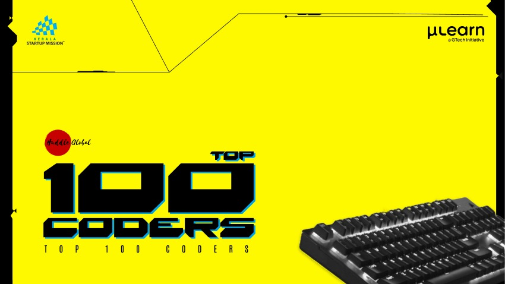

Welcome to Kerala Top 100 Coders, the highlight of Huddle Global 2023! This event aims to identify and showcase the most talented coders from across the state of Kerala and connect them with startups and industries. Our mission is to foster a vibrant startup ecosystem and turn these talented individuals into a valuable resource army.

---

## How to Participate

### Step 1:

Join the Gtech Mulearn Discord Server.

### You can join the server by clicking [here](https://discord.gg/gtech-mulearn-771670169691881483).

#

### Step 2:

Check the `top100-announcements` channel on the Discord server for further information and updates.

#

### Step 3:

Create your own portfolio in this repository's `readme.md` file by following these instructions:

- [x] Fork this repository to your GitHub account.
- [x] Edit the `readme.md` file in your forked repository.

#

> In your portfolio, include the following details:
>
> > **History of Open Source Contributions:** Share details of your open-source contributions, whether they are your own projects or contributions to highly popular projects in the open-source community.
> >
> > **History of Community Engagement:** Discuss your history of community engagement in a technical capacity, such as answering questions on platforms like Stack Overflow or actively participating in technical forums like mailing lists and Discord servers.
> >
> > **Highly Visible Technical Content:** Highlight any highly visible technical blog posts, articles, or video series you have created.
> >
> > **Highly Used Software Tools:** If you've developed software tools that are widely used by users (not just contributors), mention them.
> >
> > **Competitive Website Profiles:** Share your profiles on competitive websites like Exercism, HackerRank, Kaggle, or any others you're active on.
> >
> > **Leadership and Influence:** explain how you meet the requirement for being a leader or influencer in your domain. Provide clear examples of your leadership and influencing skills.
> >
> > **Networking:** explain your networking skills and how you plan to engage with the Top 100 community. Outline how you will influence and lead others in your respective field.
> >
> > **As a Top 100 Member:** outline why you are applying for this Top 100 and explain how it relates to your current profession. Specify how being in the Top 100 will benefit your career.
> >
> > **Career Plan:** outline your immediate and longer-term plans to contribute to making the Kerala Startup Ecosystem better. Share your thoughts on how Kerala can excel in the Technology Startup Ecosystem for the future.
>
> - [x] Once you've completed your portfolio, share the link to your forked repository in the `top100-introduction` channel on the Discord server.

#

#### Discord Channels

 

:memo: **Note:** That's it! You're all set to participate in Kerala Top 100 Coders - Huddle Global 2023.Keep an eye on the announcements channel for any additional instructions or updates.If you have any questions or need assistance, please feel free to ask on the Discord server.

#

